# Multi-Region Microservices Platform

## Architecture

```
User → S3 (Frontend) → ALB → /users → EC2 (API)
                          → /auth → Lambda (Auth)
```

---

## Phase 1: S3 Frontend

### 1. Create Bucket
- **S3** → Create bucket
- **Bucket name**: `your-app-frontend` (must be unique)
- **Uncheck**: "Block all public access"
- Click **Create**

### 2. Enable Static Website Hosting
- Bucket → **Properties** → **Static website hosting**
- **Edit** → **Enable**
- Index document: `index.html` → Save

### 3. Upload Frontend
- Bucket → **Objects** → **Upload** → Upload `index.html`

### 4. Configure CORS
- Bucket → **Permissions** → **Cross-origin resource sharing (CORS)**
- Edit and paste:
```json
[
    {
        "AllowedOrigins": ["*"],
        "AllowedMethods": ["GET", "POST", "PUT", "DELETE"],
        "AllowedHeaders": ["*"]
    }
]
```
- Save

### 5. Add Bucket Policy (for public access)
- Bucket → **Permissions** → **Bucket Policy**
- Paste (replace `Bucket-Name`):
```json
{
    "Version": "2012-10-17",
    "Statement": [{
        "Sid": "PublicReadGetObject",
        "Effect": "Allow",
        "Principal": "*",
        "Action": "s3:GetObject",
        "Resource": "arn:aws:s3:::Bucket-Name/*"
    }]
}
```

### 📸 Screenshots 
- [x] S3 bucket created (show name)
  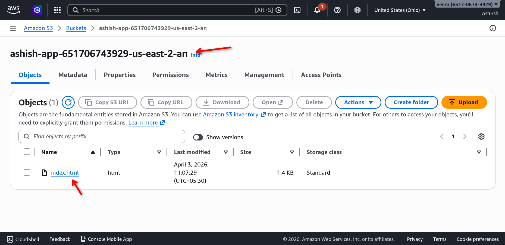
- [x] Static website hosting enabled (show endpoint URL)
  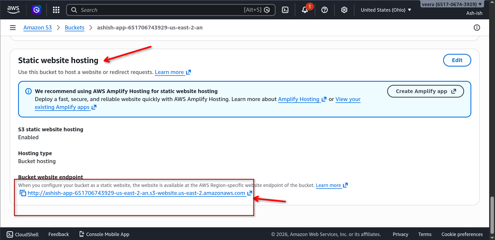
- [x] CORS configuration saved
  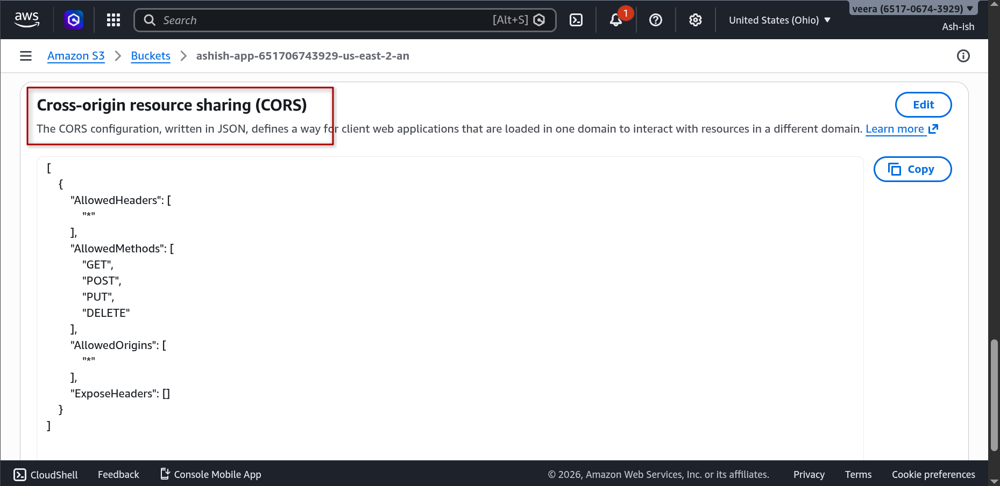
- [x] Bucket policy applied
  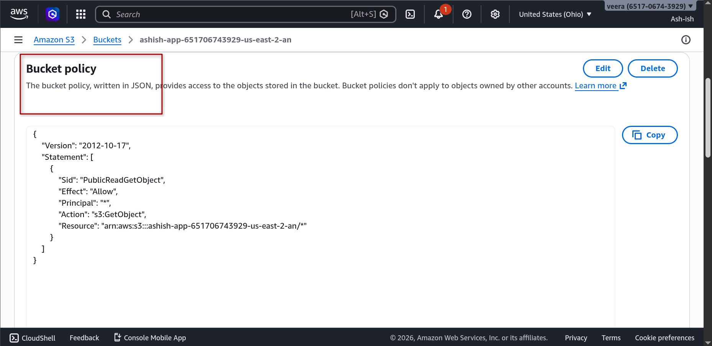

---

## Phase 2: Lambda Auth Service

### 1. Create Function
- **Lambda** → Create function → Author from scratch
- **Function name**: `ashish-auth-function`
- **Runtime**: Node.js 18.x
- Click **Create function**

### 2. Add Code
```javascript
export const handler = async (event) => {
  return {
    statusCode: 200,
    headers: {
      "Content-Type": "application/json",
      "Access-Control-Allow-Origin": "*",
      "Access-Control-Allow-Headers": "*"
    },
    body: JSON.stringify({
      token: "dummy-jwt-token-12345",
      user: "demo-user"
    })
  };
};
```

### 3. Add Permission (Critical!)
**Option A (Console):**
- Configuration → Permissions → Add permission
- AWS service → ELB → Action: `lambda:InvokeFunction`
- ARN: ALB ARN 

### 4. Test
- Click **Test** → Invoke → Verify JSON response

### 📸 Screenshots 
- [x] Lambda function created
  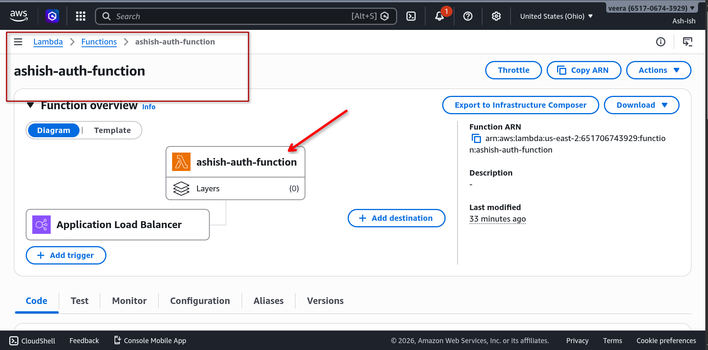
- [x] Code deployed (show handler)
  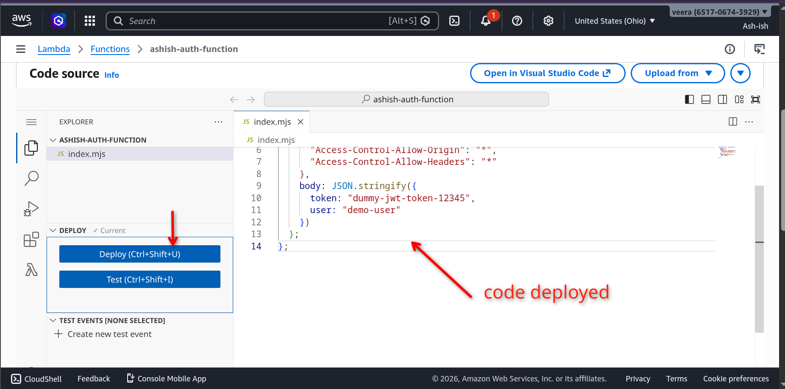
- [x] Permission added to resource-based policy
  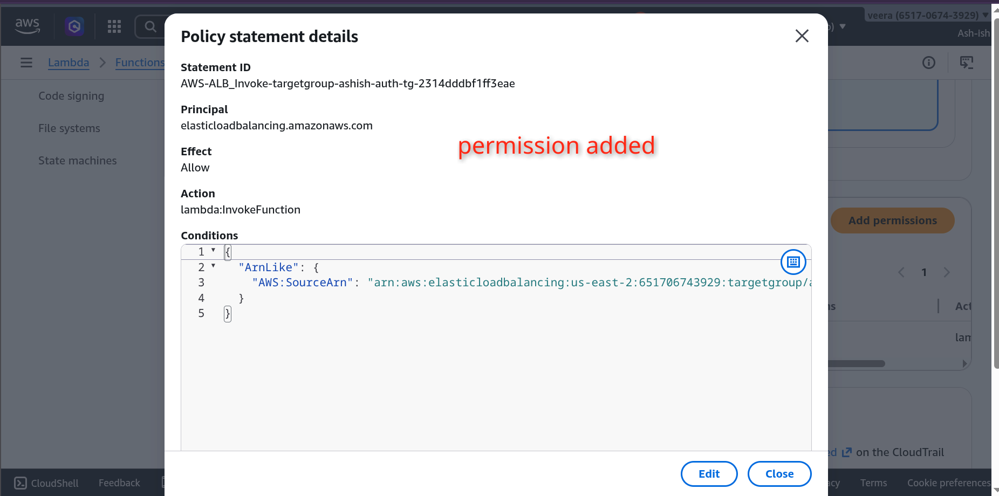
- [x] Test successful (shows token response)
  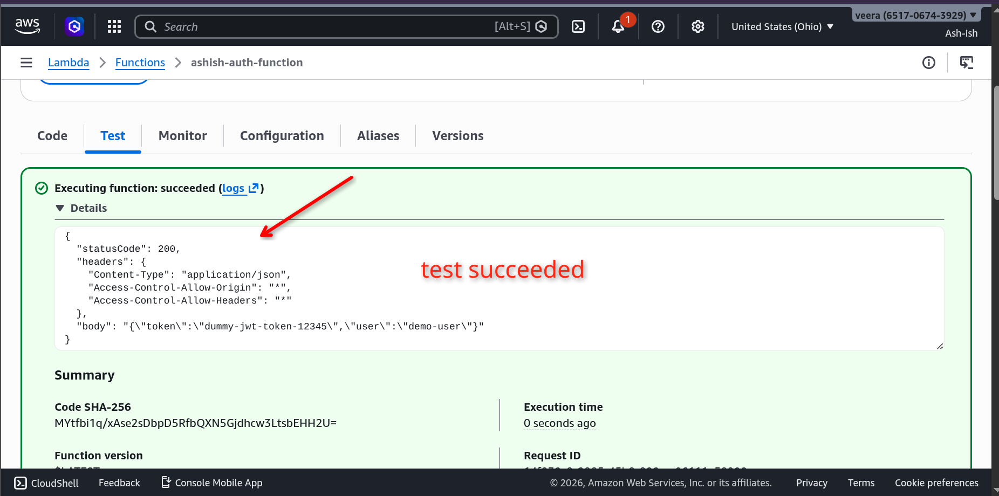

---

## Phase 3: EC2 API Server

### 1. Launch Instance
- **EC2** → Launch Instances
- Name: `api-server`
- AMI: Amazon Linux 2
- Instance type: t3.micro
- Key pair: Create or select existing
- Network: Default VPC, Subnet
- Security group:
  - SSH (22) from My IP
  - HTTP (80) from Anywhere
  - Custom TCP (3000) from Anywhere

### 2. User Data (Auto-install)
Expand **Advanced details** → **User data**:
```bash
#!/bin/bash
yum update -y
curl -sL https://rpm.nodesource.com/setup_18.x | bash -
yum install -y nodejs
mkdir /app
cd /app
cat > index.js << 'EOF'
const http = require("http");
const server = http.createServer((req, res) => {
  res.writeHead(200, {
    "Access-Control-Allow-Origin": "*",
    "Access-Control-Allow-Headers": "*"
  });
  res.end(JSON.stringify({ users: ["user1", "user2", "user3"] }));
});
server.listen(3000, () => console.log("API running on port 3000"));
EOF
nohup node index.js > /tmp/node.log 2>&1 &
```

### 3. Verify
- Wait 2-3 minutes
- Test: `http://<PUBLIC-IP>:3000` → Should return JSON

### 📸 Screenshots 
- [x] Instance running (show Public IP)
  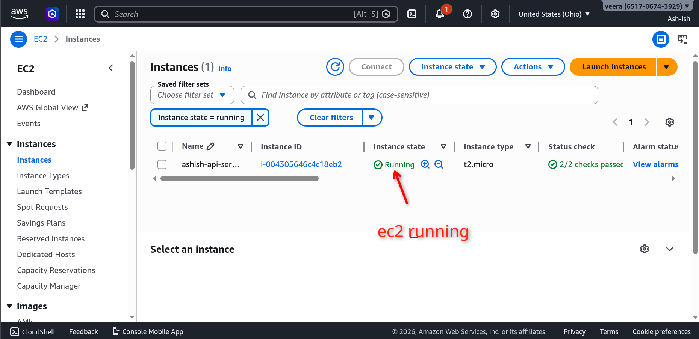
  
- [x] Security group rules
  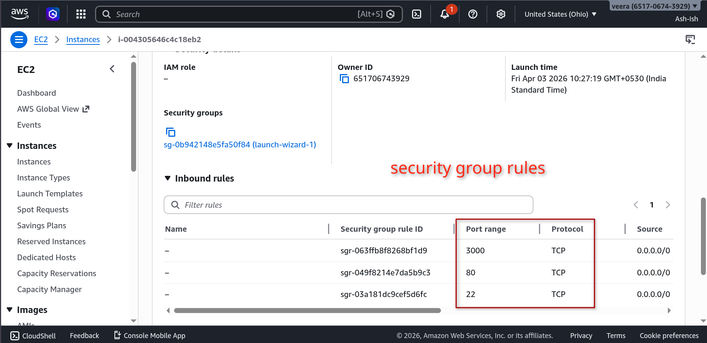
  
  

---

## Phase 4: Application Load Balancer

### 1. Create Target Group (EC2)
- **EC2** → Target Groups → Create target group
- Name: `ashish-api-tg`
- Target type: Instance
- Protocol: HTTP, Port: 3000
- Health path: `/`
- Select EC2 instance → Include as pending → Create

### 2. Create Target Group (Lambda)
- Target Groups → Create target group
- Name: `ashish-auth-tg`
- Target type: **Lambda function**
- Select `ashish-auth-function` → Create

### 3. Create ALB
- **Load Balancers** → Create Load Balancer → Application Load Balancer
- Name: `ashish-app-alb`
- Scheme: Internet-facing
- Security group: Allow HTTP (80) from Anywhere
- Listeners: HTTP :80
- Default action: (leave empty, add rules next)

### 4. Configure Listener Rules
- ALB → Listeners → View/edit rules
- Add rules:
  - **IF** path `/auth*` → Forward to `ashish-auth-tg`
  - **IF** path `/users*` → Forward to `ashish-api-tg`
- Save

### 5. Enable Cross-Zone & Sticky Sessions
- ALB → Attributes → Enable cross-zone load balancing
- Target group `ashish-api-tg` → Attributes → Edit → Enable stickiness

### 📸 Screenshots 
- [x] Target groups created (show both EC2 and Lambda)
  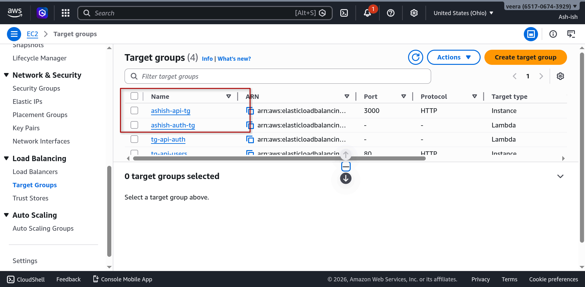
  
- [x] ALB created (show DNS name)
  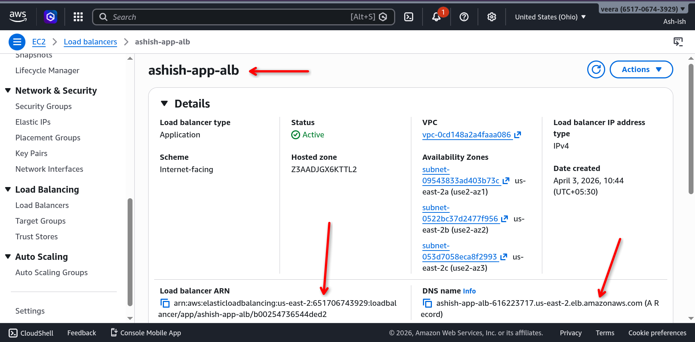
  
- [x] Listener rules configured (show path routing)
  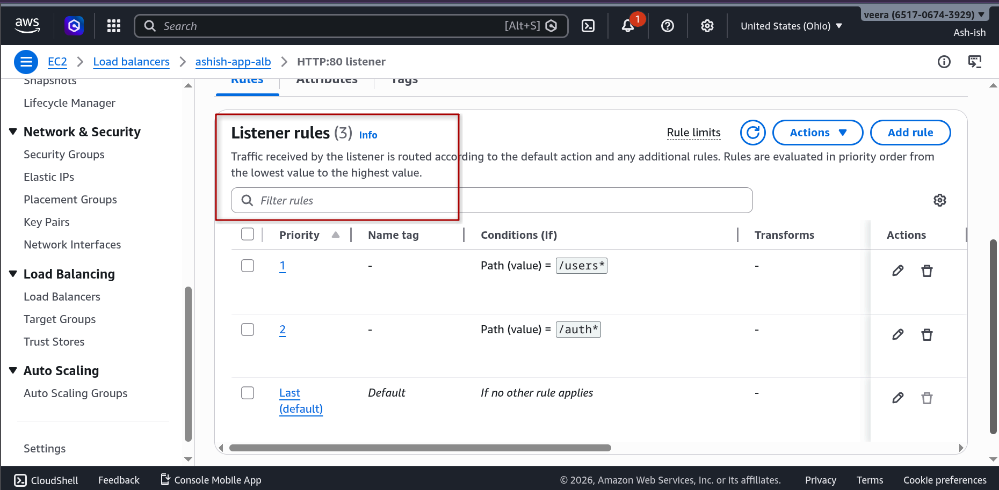
  
- [x] Cross-zone enabled
  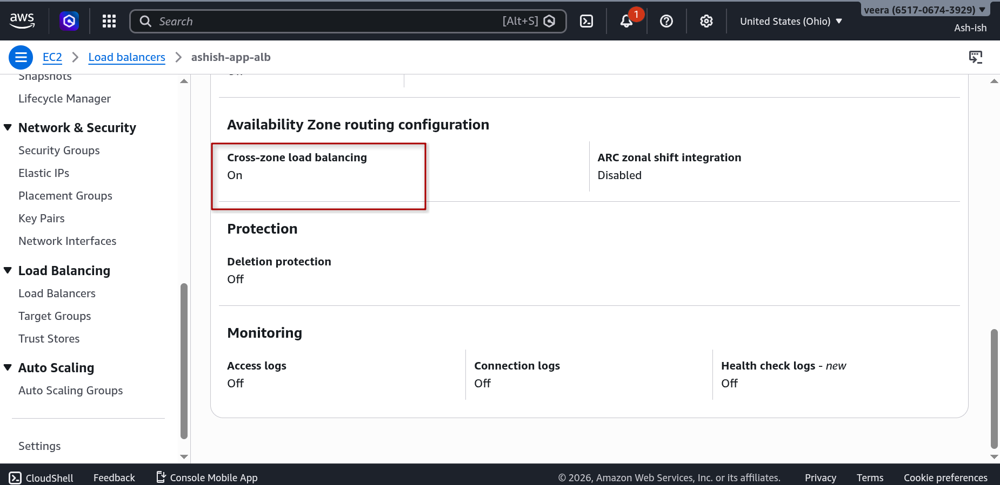
  
  

---

## Phase 5: Update Frontend

1. Copy ALB DNS name from **Load Balancers**
2. Edit `index.html`:
   ```javascript
   const ALB = "http://YOUR-ALB-DNS";  // NO trailing slash!
   ```
3. Upload to S3: `aws s3 cp index.html s3://your-bucket/`

---

## Final Test

Open S3 website endpoint in browser:
1. Click **Call Users API** → `{"users":["user1","user2","user3"]}`
2. Click **Call Auth Service** → `{"token":"dummy-jwt-token-12345","user":"demo-user"}`

### 📸 Screenshots 
- [x] Final working app (both buttons return JSON)
  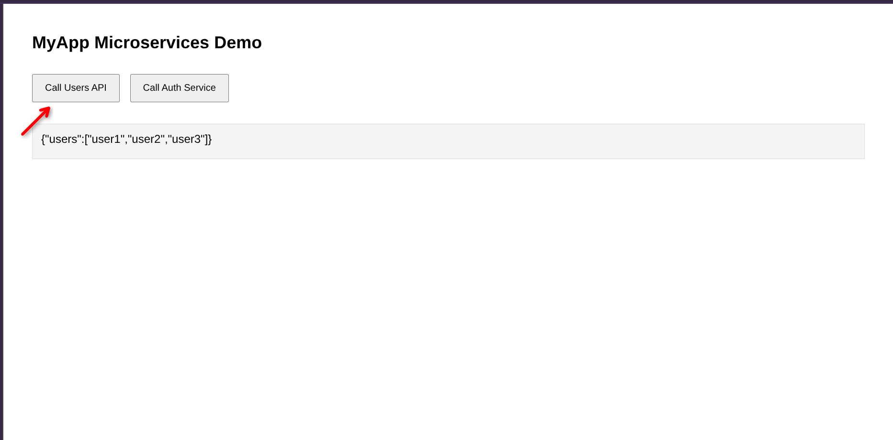
  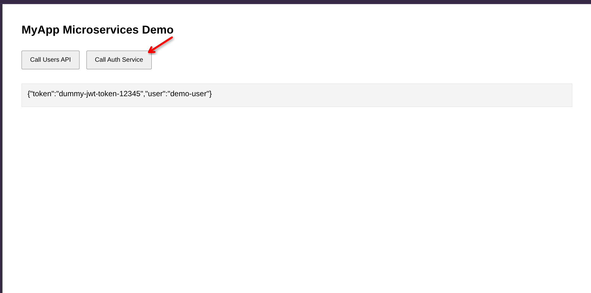

---

## Quick Reference

| Component | Key Setting |
|-----------|-------------|
| S3 | Static hosting ON, CORS + Bucket Policy |
| Lambda | Content-Type header, ALB permission |
| EC2 | Node.js on port 3000 via user data |
| ALB | Cross-zone, sticky sessions |
| Routing | `/auth*` → Lambda, `/users*` → EC2 |

---

## Troubleshooting

| Issue | Solution |
|-------|----------|
| Auth returns download file | Add `Content-Type: application/json` in Lambda headers |
| Double slash in URL | Remove trailing slash from ALB variable |
| Auth button not working | Check listener rules have `/auth*` path |
| Can't resolve ALB DNS | Verify ALB is in same region |
